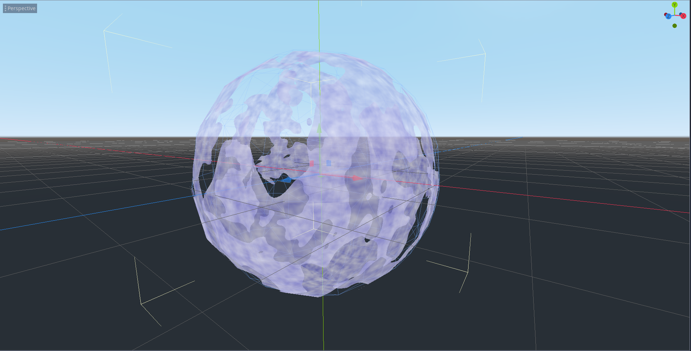
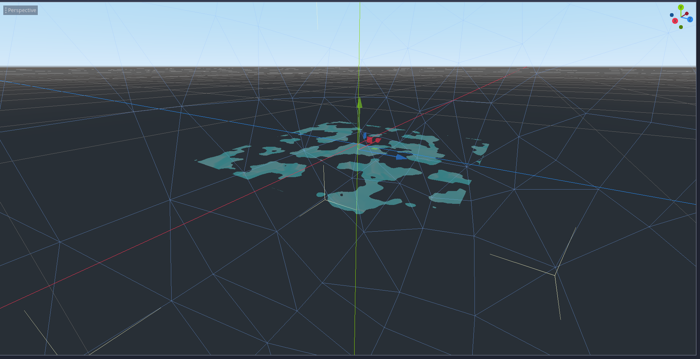
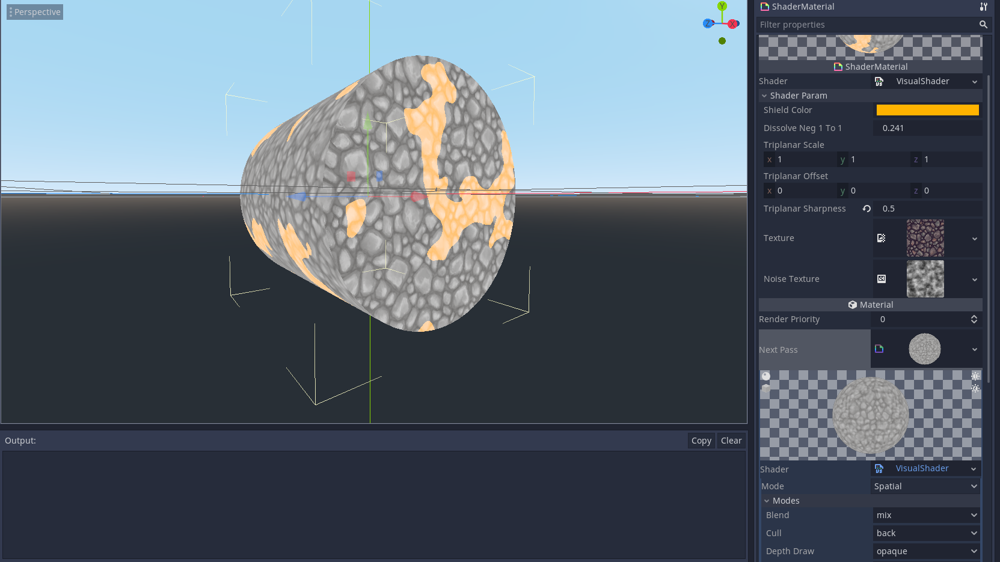

## This is the Shield Shader
---

`Shader Params`

`Shield Color` sets overlay `Color`

`Disolve Neg 1 to 1` allows you to disolve manually or via `Tween` or `Animation` `Keyframe`s

On `Texture` add a custom `StreamTexture` ( or `NoiseTexture` with Simplex Noise and `Seamless` set to `true` for quick results).

On `Noise Texture` add a `NoiseTexture` with Simplex Noise and `Seamless` set to `true`.

You can achieve results like the following:

## **Sphere**

## **Quad**

## **Cylinder**
With `Next Pass` we can draw the another instance of the shader but with different color after clicking "**Make Unique**" and changing our new shader's`Cull` to `back` from the default `disabled`

